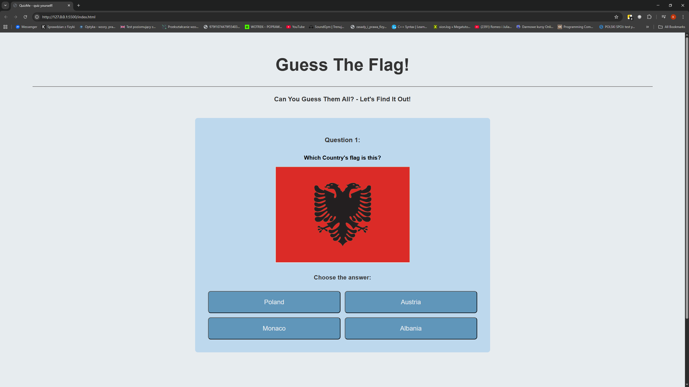

# Flag Quiz
A simple quiz to learn country flags.

## Description
This project is a web-based quiz game for testing knowledge of country flags. It was created as a personal project for an internship application at EPAM. The quiz displays one flag at a time, lets users select an answer, and provides immediate feedback. At the end, the total score is shown. This project demonstrates DOM manipulation, event handling, and basic JavaScript logic.

## Features
- Displaying country flags and sets of questions.
- Automatic correctness check and visual feedback.
- Highlighting the correct answer if the user chooses incorrectly.
- Scoring system with total score display.
- Ability to restart the quiz without refreshing the page.

## Technologies
- HTML
- CSS
- JavaScript

## How to run
1. Clone or download the repository.
2. Open `index.html` in the browser.
3. Select an answer for each question.
4. View your score at the end.
5. Click "restart" to play again.

## Demo

## Author
Kacper J.
[GitHub](https://github.com/JabelThEngineer)

## Challenges
The most challenging part was working with JavaScript. Although I knew the basics, it was my first time using functions like `addEventListener()` or `setTimeout()`, so
it took me a while to understand how to use them properly.
I got help from ChatGPT to make everything work correctly, but I learned a lot about using JS for interactive features.
This is my first 'full' project made with HTML, CSS and JS.
